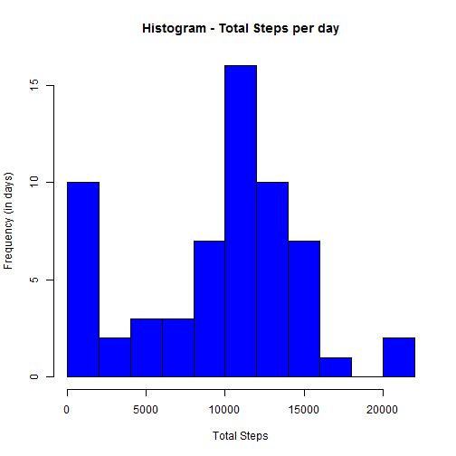
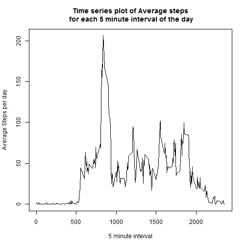
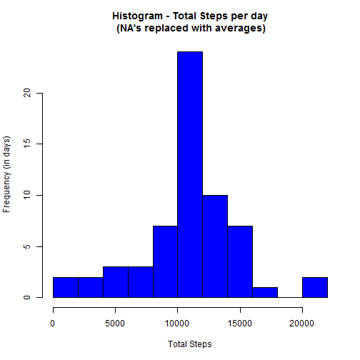
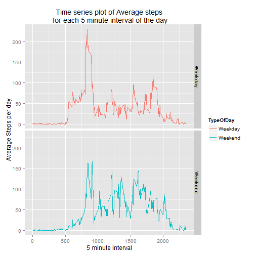

##Loading and preprocessing the data

In this part we load the data by reading the csv file and we transform the date column in date format. We will also load the dplyr library that is used in the following parts of this assignment. 


```r
activity <-read.csv("activity.csv")

library(dplyr)
activity[,2]<-as.Date(activity$date,"%Y-%m-%d" )
```


##What is mean total number of steps taken per day?

In the second part, we summarize the data by removing the rows with NA values. Then, we create a histogram with the total number of steps taken per day. Finally, we calculate the mean and median of the total number of steps taken per day.


```r
SummaryActivity<- activity %>% group_by(date)%>%summarize(TotalSteps = sum(steps,na.rm=TRUE))

hist(SummaryActivity$TotalSteps, main= "Histogram - Total Steps per day", xlab="Total Steps", ylab = "Frequency (in days)", col="blue", breaks = 10)
```

 

```r
mean(SummaryActivity$TotalSteps)
```

```
## [1] 9354.23
```

```r
median(SummaryActivity$TotalSteps)
```

```
## [1] 10395
```

As we can see from the results and the histogram, we make a bit over 10000 steps per day. 


##What is the average daily activity pattern?

We continue our analysis by looking on the avaerage daily activity pattern. Firstly, we produce a time series plot of the 5-minute interval (x-axis) and the average number of steps taken, averaged across all days (y-axis).
Secondly, we calculate and show the 5-minute interval, on average across all the days in the dataset, that contains the maximum number of steps.


```r
SummaryActivity2<- activity %>% group_by(interval)%>%summarize(AverageSteps = mean(steps,na.rm=TRUE))

plot(SummaryActivity2, type="l", xlab = "5 minute interval", ylab = "Average Steps per day", main="Time series plot of Average steps\n for each 5 minute interval of the day")
```

 

```r
# We sort the data table by the maximum avergae steps and we check the first two 
# lines. The first one will also show the interval with the maximum average steps.

SummaryActivity2 <- arrange(SummaryActivity2, desc(AverageSteps))
head(SummaryActivity2,2)
```

```
## Source: local data frame [2 x 2]
## 
##   interval AverageSteps
## 1      835     206.1698
## 2      840     195.9245
```

Based on the results of the above plot, we conclude that the majority of the steps iare taken between 8 to 9 o'clock in the morning. This makes sense as this is the time that everyone goes to work. Also the maximum average number of steps are happening on the between 8:35 to 8:40 interval in the morning with more than 206 steps.


##Imputing missing values

This part of the report looks on the same data but instead of excluding the missing values for the steps, it replaces them with the average value of the steps for the same interval from all the other days. In this way we do not distort the data and our results are not biased.
Before we do that, we check how many are the NA's in the initial dataset. 


```r
# To find the number of NA's we will filter the activity dataset removing all the # non NA values and then we will count the number of the rows. 

CountNA <- filter(activity, is.na(steps))
nrow(CountNA)
```

```
## [1] 2304
```

```r
# By merging the activity with the SummaryActivity2 table that contains the
# averages for each interval, we will create a new column with the averages. 

ActivityAdjusted <-merge(activity, SummaryActivity2)

# We then replace the NA's with the average in the step column, remove the
# "AverageStep" column and sort the results. In this way the resulting dataset is
# the same with the activity one and the only change is the replacement of the
# NA's

ActivityAdjusted<- ActivityAdjusted%>%mutate(steps=ifelse(is.na(steps),AverageSteps,steps))%>%select(steps, date, interval)%>%arrange(date,interval)
```

The next part of the code creates the histogram and calculates the mean and median of the adjusted activity dataset.


```r
SummaryActivityAdjusted<- ActivityAdjusted %>% group_by(date)%>%summarize(TotalSteps = sum(steps))

hist(SummaryActivityAdjusted$TotalSteps, main= "Histogram - Total Steps per day\n (NA's replaced with averages)", xlab="Total Steps", ylab = "Frequency (in days)", col="blue", breaks = 10)
```

 

```r
mean(SummaryActivityAdjusted$TotalSteps)
```

```
## [1] 10766.19
```

```r
median(SummaryActivityAdjusted$TotalSteps)
```

```
## [1] 10766.19
```

As we can see from the results these values differ from the results in the first part of this report. They are slightly higher than the previous results and now both mean and median are the same and equal to 10,766.


##Are there differences in activity patterns between weekdays and weekends?

In the last part of this report, we explore the differences in activity patterns between weekdays and weekend. We use the "ActivityAdjusted" dataset  with the filled-in missing values for this part. Initially we create a new variable (column) showing if this day is a weekday or a weekend. Then, we make a panel plot containing a time series plot (i.e. type = "l") of the 5-minute interval (x-axis) and the average number of steps taken, averaged across all weekday days or weekend days (y-axis).

 

```r
# We initially create the summary table.
SummaryActivityAdjusted2<- ActivityAdjusted %>% mutate(TypeOfDay = ifelse(weekdays(date)=="Saturday"|weekdays(date)=="Sunday","Weekend", "Weekday"))%>%group_by(TypeOfDay,interval)%>%summarize(AverageSteps = mean(steps))

#We then plot the data by using the ggplot2 library
library(ggplot2)

qplot(interval, AverageSteps, data = SummaryActivityAdjusted2, geom = c("line"), facets = TypeOfDay~., colour = TypeOfDay,ylab = "Average Steps per day", xlab = "5 minute interval", main = "Time series plot of Average steps\n for each 5 minute interval of the day")
```

 

As we can see, the weekdays have a similar timeplt as per the plot on the third part of this report but we can see a different timeplot for the weekend. The results do make sense and enhance our conclusion that during the weekdays, there is a peak just before 9 o'clock when the majority of people are going to work and they need to walk there. During weekends, the pattern is a bit different.

